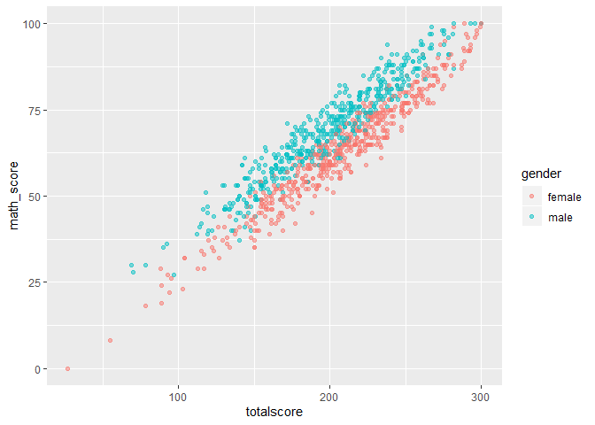
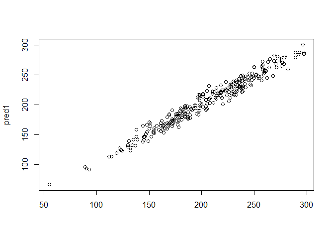

Predicting Student Test Scores
================
Braden Baker
12/22/2019

The student performance dataset has many coloumns listed as character
data types that are really factors. There is also some coloumn names
with spaces that are renamed to work better with R. The total score
variable is also created as a coloumn to see a quick view of a students
overall performance in one column.

``` r
library(tidyverse)
```

    ## -- Attaching packages ------------------------------------------------------------------------------------------------------------------------ tidyverse 1.3.0 --

    ## <U+2713> ggplot2 3.2.1     <U+2713> purrr   0.3.3
    ## <U+2713> tibble  2.1.3     <U+2713> dplyr   0.8.3
    ## <U+2713> tidyr   1.0.0     <U+2713> stringr 1.4.0
    ## <U+2713> readr   1.3.1     <U+2713> forcats 0.4.0

    ## -- Conflicts --------------------------------------------------------------------------------------------------------------------------- tidyverse_conflicts() --
    ## x dplyr::filter() masks stats::filter()
    ## x dplyr::lag()    masks stats::lag()

``` r
library(openintro)
```

    ## Please visit openintro.org for free statistics materials

    ## 
    ## Attaching package: 'openintro'

    ## The following object is masked from 'package:ggplot2':
    ## 
    ##     diamonds

    ## The following objects are masked from 'package:datasets':
    ## 
    ##     cars, trees

``` r
library(readr)
StudentsPerformance <- read_csv("StudentsPerformance.csv")
```

    ## Parsed with column specification:
    ## cols(
    ##   gender = col_character(),
    ##   `race/ethnicity` = col_character(),
    ##   `parental level of education` = col_character(),
    ##   lunch = col_character(),
    ##   `test preparation course` = col_character(),
    ##   `math score` = col_double(),
    ##   `reading score` = col_double(),
    ##   `writing score` = col_double()
    ## )

``` r
str(StudentsPerformance)
```

    ## Classes 'spec_tbl_df', 'tbl_df', 'tbl' and 'data.frame': 1000 obs. of  8 variables:
    ##  $ gender                     : chr  "female" "female" "female" "male" ...
    ##  $ race/ethnicity             : chr  "group B" "group C" "group B" "group A" ...
    ##  $ parental level of education: chr  "bachelor's degree" "some college" "master's degree" "associate's degree" ...
    ##  $ lunch                      : chr  "standard" "standard" "standard" "free/reduced" ...
    ##  $ test preparation course    : chr  "none" "completed" "none" "none" ...
    ##  $ math score                 : num  72 69 90 47 76 71 88 40 64 38 ...
    ##  $ reading score              : num  72 90 95 57 78 83 95 43 64 60 ...
    ##  $ writing score              : num  74 88 93 44 75 78 92 39 67 50 ...
    ##  - attr(*, "spec")=
    ##   .. cols(
    ##   ..   gender = col_character(),
    ##   ..   `race/ethnicity` = col_character(),
    ##   ..   `parental level of education` = col_character(),
    ##   ..   lunch = col_character(),
    ##   ..   `test preparation course` = col_character(),
    ##   ..   `math score` = col_double(),
    ##   ..   `reading score` = col_double(),
    ##   ..   `writing score` = col_double()
    ##   .. )

``` r
head(StudentsPerformance)
```

    ## # A tibble: 6 x 8
    ##   gender `race/ethnicity` `parental level… lunch `test preparati… `math score`
    ##   <chr>  <chr>            <chr>            <chr> <chr>                   <dbl>
    ## 1 female group B          bachelor's degr… stan… none                       72
    ## 2 female group C          some college     stan… completed                  69
    ## 3 female group B          master's degree  stan… none                       90
    ## 4 male   group A          associate's deg… free… none                       47
    ## 5 male   group C          some college     stan… none                       76
    ## 6 female group B          associate's deg… stan… none                       71
    ## # … with 2 more variables: `reading score` <dbl>, `writing score` <dbl>

``` r
data <- StudentsPerformance

data <- rename(data, race_eth = 'race/ethnicity')
data <- rename(data, parenteduc = 'parental level of education')
data <- rename(data, test_prep = 'test preparation course')
data <- rename(data, math_score = 'math score')
data <- rename(data, reading_score = 'reading score')
data <- rename(data, writing_score = 'writing score')


data$gender <- as.factor(data$gender)
data$race_eth <- as.factor(data$race_eth)
data$parenteduc <- as.factor(data$parenteduc)
data$test_prep <- as.factor(data$test_prep)
data$lunch <- as.factor(data$lunch)

data <- data %>%
  mutate(totalscore =math_score+reading_score+writing_score)

str(data)
```

    ## Classes 'spec_tbl_df', 'tbl_df', 'tbl' and 'data.frame': 1000 obs. of  9 variables:
    ##  $ gender       : Factor w/ 2 levels "female","male": 1 1 1 2 2 1 1 2 2 1 ...
    ##  $ race_eth     : Factor w/ 5 levels "group A","group B",..: 2 3 2 1 3 2 2 2 4 2 ...
    ##  $ parenteduc   : Factor w/ 6 levels "associate's degree",..: 2 5 4 1 5 1 5 5 3 3 ...
    ##  $ lunch        : Factor w/ 2 levels "free/reduced",..: 2 2 2 1 2 2 2 1 1 1 ...
    ##  $ test_prep    : Factor w/ 2 levels "completed","none": 2 1 2 2 2 2 1 2 1 2 ...
    ##  $ math_score   : num  72 69 90 47 76 71 88 40 64 38 ...
    ##  $ reading_score: num  72 90 95 57 78 83 95 43 64 60 ...
    ##  $ writing_score: num  74 88 93 44 75 78 92 39 67 50 ...
    ##  $ totalscore   : num  218 247 278 148 229 232 275 122 195 148 ...

There is a clear divide between the score on each test and gender. Males
tended to have a higher math score and a lower reading and writing score
than females.

``` r
ggplot(data, aes(x=totalscore, y=math_score, color=gender)) + geom_point(alpha=0.5)
```

<!-- -->

``` r
ggplot(data, aes(x=totalscore, y=reading_score, color=gender)) + geom_point(alpha=0.5)
```

<!-- -->

``` r
ggplot(data, aes(x=totalscore, y=writing_score, color=gender)) + geom_point(alpha=0.5)
```

<!-- -->

Looking at the data, female students averaged more points than males in
all but math score.

``` r
genderresults <- data %>%
  group_by(gender) %>%
  summarise(mavg=mean(math_score), ravg=mean(reading_score), wavg=mean(writing_score), tavg=mean(totalscore))

genderresults
```

    ## # A tibble: 2 x 5
    ##   gender  mavg  ravg  wavg  tavg
    ##   <fct>  <dbl> <dbl> <dbl> <dbl>
    ## 1 female  63.6  72.6  72.5  209.
    ## 2 male    68.7  65.5  63.3  198.

The rest of the data shows that a majority of the other variables in the
dataset are fairly even in both genders. Showing that there is not any
other obvious variable that could explain why females are getting such
higher scores in this dataset.

``` r
ggplot(data, aes(x=gender, fill=test_prep)) + geom_bar(position = 'dodge')
```

<!-- -->

``` r
ggplot(data, aes(x=gender, fill=lunch)) + geom_bar(position = 'dodge')
```

<!-- -->

``` r
ggplot(data, aes(x=gender, fill=parenteduc)) + geom_bar(position = 'dodge')
```

<!-- -->

The only clear difference is in race and ethnicity. Females had a much
higher number of students that fell under racial group C than males.
Racial group C is the median average total score, likely bringing the
female score up. The males also had a higher number of students in
racial group A, which has the lowest average score, likely bringing
their score down.

``` r
ggplot(data, aes(x=gender, fill=race_eth)) + geom_bar(position = 'dodge')
```

<!-- -->

``` r
ggplot(data, aes(x=race_eth, y=totalscore)) + geom_boxplot()
```

<!-- -->

Looking at the lunch variable, there appears to be some correlation
between lunch and higher test scores.

``` r
ggplot(data, aes(x=totalscore, y=math_score, color=lunch)) + geom_point(alpha=0.5)
```

<!-- -->

``` r
ggplot(data, aes(x=totalscore, y=reading_score, color=lunch)) + geom_point(alpha=0.5)
```

<!-- -->

``` r
ggplot(data, aes(x=totalscore, y=writing_score, color=lunch)) + geom_point(alpha=0.5)
```

<!-- -->

When only using those below or above one standard deviation it becomes
clear that a majority of the best students are ones with standard lunch.
Along with the lower scores still being a mix of students with standard
or free/reduced lunch.

``` r
lunchdata <- data %>%
  group_by(lunch) %>%
  summarize(mavg=mean(math_score), ravg=mean(reading_score), wavg=mean(writing_score), tavg=mean(totalscore))

sd(data$totalscore)
```

    ## [1] 42.77198

``` r
mean(data$totalscore)
```

    ## [1] 203.312

``` r
lunchdatagraph <- data %>%
  group_by(lunch) %>%
  filter(totalscore < 161 | totalscore > 245)

ggplot(lunchdatagraph, aes(x=totalscore, y=math_score, color=lunch)) + geom_point(alpha=0.5)
```

<!-- -->

``` r
ggplot(lunchdatagraph, aes(x=totalscore, y=reading_score, color=lunch)) + geom_point(alpha=0.5)
```

<!-- -->

``` r
ggplot(lunchdatagraph, aes(x=totalscore, y=writing_score, color=lunch)) + geom_point(alpha=0.5)
```

<!-- -->

Using linear regression to predict total score, gender and lunch were
used, along with writing score because it had the largest difference in
average score, between male and female compared to the other tests.
Which resulted in an accurate model with an R-squared of 0.9635.

``` r
dataforreg <- data

nrows = nrow(data)

set.seed(999)

rows <- sample(nrows)
dataforreg = dataforreg[rows,]
split <- round(nrow(dataforreg) * .70)
train = dataforreg[1:split,]
test = dataforreg[(split+1):nrows,]

mod1 <- lm(totalscore ~ gender+writing_score+lunch, data=train)
summary(mod1)
```

    ## 
    ## Call:
    ## lm(formula = totalscore ~ gender + writing_score + lunch, data = train)
    ## 
    ## Residuals:
    ##      Min       1Q   Median       3Q      Max 
    ## -23.8611  -5.0586  -0.1162   5.8504  23.1389 
    ## 
    ## Coefficients:
    ##               Estimate Std. Error t value Pr(>|t|)    
    ## (Intercept)    1.16427    1.62470   0.717    0.474    
    ## gendermale    15.50819    0.66136  23.449  < 2e-16 ***
    ## writing_score  2.82918    0.02241 126.260  < 2e-16 ***
    ## lunchstandard  3.60209    0.67208   5.360 1.14e-07 ***
    ## ---
    ## Signif. codes:  0 '***' 0.001 '**' 0.01 '*' 0.05 '.' 0.1 ' ' 1
    ## 
    ## Residual standard error: 8.266 on 696 degrees of freedom
    ## Multiple R-squared:  0.9619, Adjusted R-squared:  0.9617 
    ## F-statistic:  5858 on 3 and 696 DF,  p-value: < 2.2e-16

``` r
pred1 <- predict(mod1, newdata = test)
result <- cbind(test$totalscore, pred1)

plot(result)
```

<!-- -->
